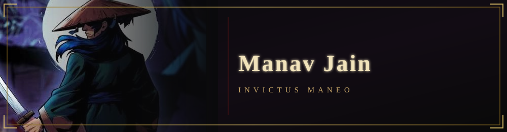

<div align="center">



<a href="https://www.linkedin.com/in/manav-jain-554635242/">
  
</a>
<a href="mailto:manavjain019@gmail.com">
  
</a>


<br/><br/>


</div>

<br/>

## 📁 FILE // 001 — PROFILE

```yaml
name:        Manav Jain
status:      3rd Year B.Tech — Information Technology, DJ Sanghvi College of Engineering
gpa:         8.50 / 10.0
focus:       CS · AI/ML — Explainable AI, Federated Learning, Agentic Systems
publications: 3 papers, first author on all
```

---

## 🎯 ACTIVE OPERATIONS

**End-to-End Medical AI System**
Full-stack medical AI pipeline combining ensemble modeling with explainable AI methods for interpretable predictions, extended with federated learning for privacy-preserving training across distributed data, and agentic AI components for autonomous workflow orchestration.

**Trading Behavioral Analysis Model** — *Internship, Trading Startup*
Built a model analyzing trading behavior patterns to surface insights on decision-making and risk, applied within a live trading startup environment.

---

## 🧰 ARSENAL

<div align="center">


</div>

---

## 📊 INTEL LOG

<div align="center">


</div>

---

## 📚 CURRENTLY LEARNING

```yaml
now:
  - Andrej Karpathy's "Zero to Hero" — neural networks from scratch
```

---

## 🐍 CONTRIBUTION TRAIL

<div align="center">

<picture>
  <source media="(prefers-color-scheme: dark)" srcset="https://raw.githubusercontent.com/Jmanav/Jmanav/output/github-contribution-grid-snake-dark.svg" />
  <source media="(prefers-color-scheme: light)" srcset="https://raw.githubusercontent.com/Jmanav/Jmanav/output/github-contribution-grid-snake.svg" />
  
</picture>

</div>

---

## 🏅 COMMENDATIONS

- 📄 **3 research papers** — first author on all
- 🏆 Hackathon **finalist** — multiple events
- 🧠 **Google Developers Group** (college chapter) — ML Research Co-Committee
- 🎙️ **MUNSOC** — Delegation Affairs
- 🌊 Community service — beach cleanups, traffic signal analysis, blood donation drives

---

## 📡 SECURE CHANNELS

<div align="center">

[](https://www.linkedin.com/in/manav-jain-554635242/)
[](mailto:manavjain019@gmail.com)
[](resume.pdf)

<br/>

<i>INVICTUS MANEO</i>

</div>
